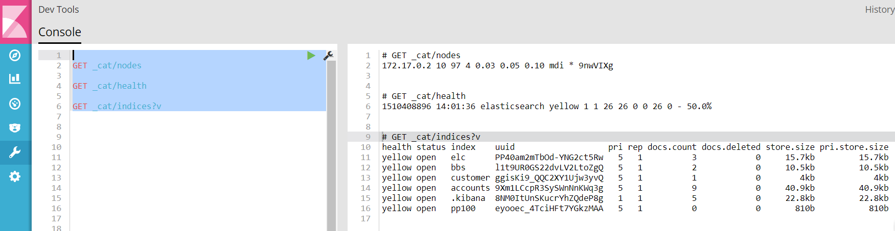
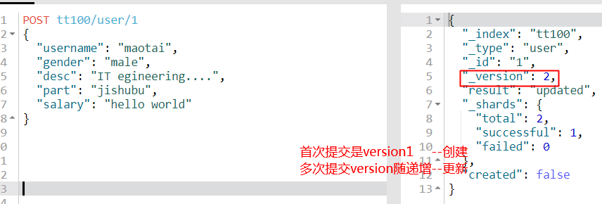
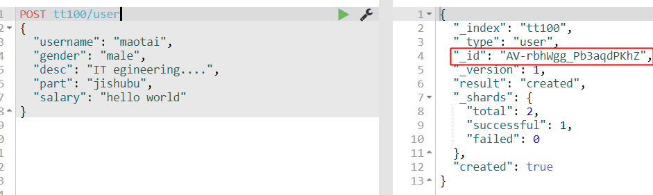
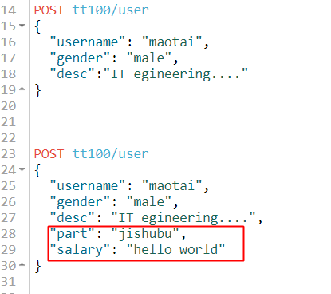
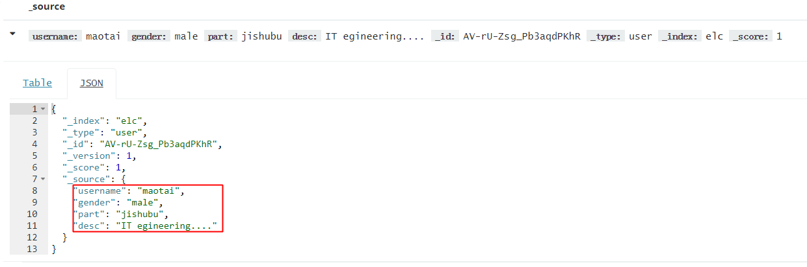
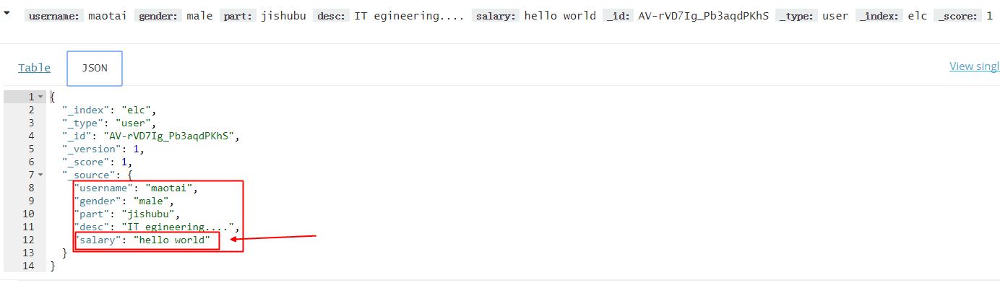

## kibana dev工具对es库的CRUD操作

es5可以看做数据库,基于resetful可以很方便的存取数据.

kibana5有Dev Tools一个工具,可以很方便的发get post put delete等http请求.

这篇文章主要介绍这个工具对es的操作.




- 创建/删除索引

  


- 创建/更新记录

  

- 创建记录(自动创建了索引, type=user)

  ```
  tt100/user   # 生成的id是随机的
  tt100/user/1 # id是固定的,这样便于更
               # 多次提交,每次version1累加1
  ```

  

- 同一个索引里每个文档的字段可以不同(kibana里各显示个的)

  ​

  




同一个索引里的记录B



